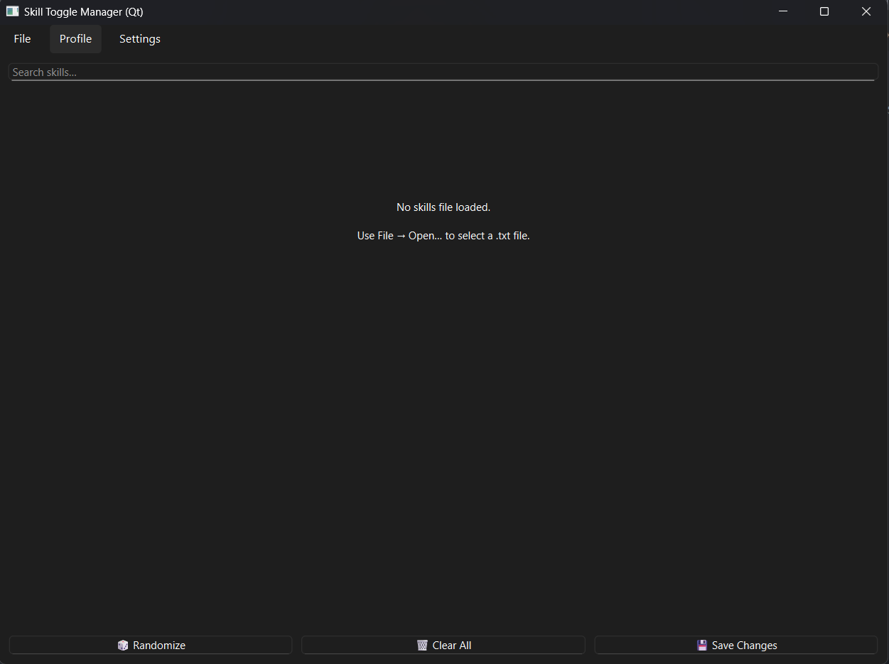
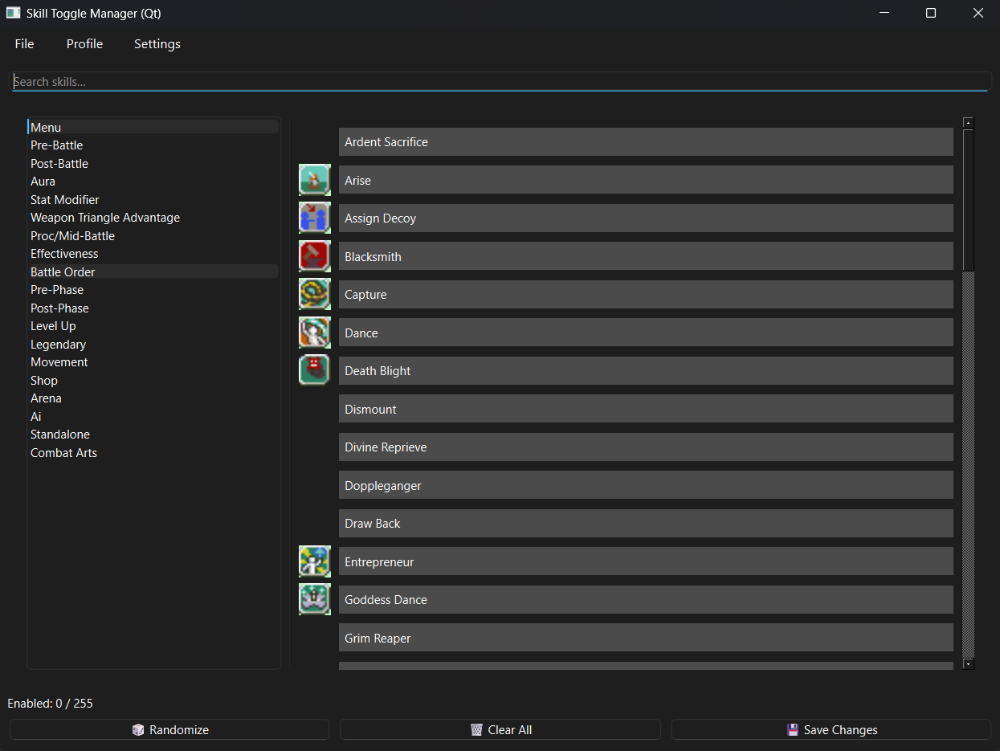
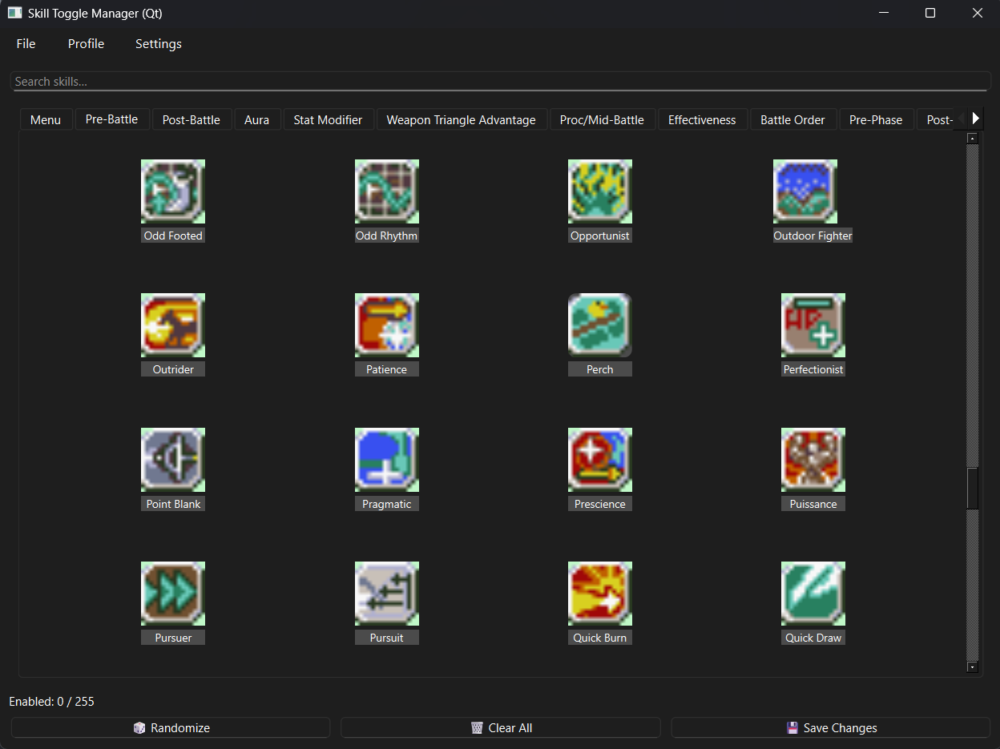

# Skill-Enabler-CSkillSystem
A python utility to enable/disable skills in the 4 main txt files that the C Skill System uses.

# Install instructions
Download and install Python (this is the specific version I used, but later shouldn't matter)
- (Windows) https://www.python.org/ftp/python/3.13.3/python-3.13.3-amd64.exe
- (Linux) $ sudo apt-get install python3.13.3

Download and install the following python package
- pip install PySide6

# Features
- Light/Dark mode
- Grid/List for skills
- Display skill categories in a Tab/List format
- Save/Load different profiles
- Randomize skills
- Clear/Save selected skills
- Skill selection counter
- Fade out unselected skills when the limit is reached
- Search for specific skills
- Sort skills A-Z or Z-A
- Icon support

# How to use
- Run ``python skill_toggle_gui.py``

# Preview images

# Generate an EXE on your own
- Install ``PyInstaller``
- Run ``pyinstaller --onefile --windowed your_script.py``
This will generate one file in your OS's architecture
